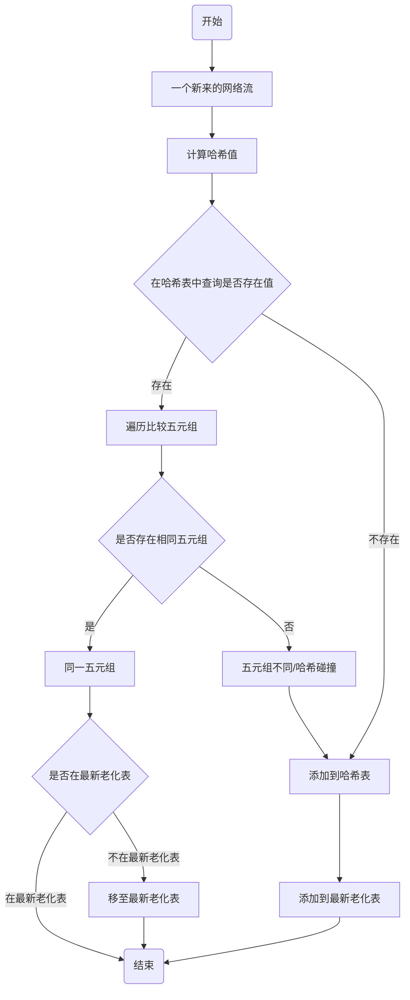
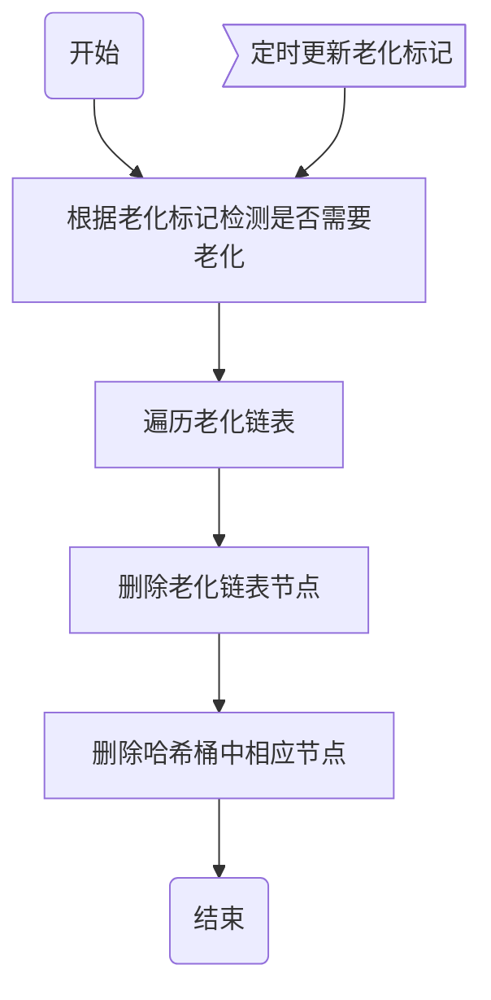

# 1 流的老化
[流的老化介绍](https://support.huawei.com/enterprise/zh/doc/EDOC1100055170/268a1162)

由于网络上的流是阵发性的，在几秒时间就会产生数万条流，而NDE（NetStream Data Exporter）设备内存的容量是一定的，这样就需要把当前的部分流删除，为后面到来的流提供内存空间，这个过程称为老化。
## 1.1 流老化的分类：
### 1）定时老化
对非活跃时间（从最后一个报文到达到当前的时间）超过非活跃老化时间，或活跃时间（从第一个报文流过到当前的时间）超过活跃老化时间的流进行老化。当在流缓存区中的流超过活跃老化时间时，系统不会将流立刻进行老化，直到一个新的流到来时，系统对流进行老化；在超过非活跃老化时间后，系统立即对流进行老化，而不管此时是否仍然处于活跃老化时间内。

活跃老化时间主要用于持续时间较长的流量，定期输出统计数据；

非活跃老化时间主要用于短时流量，流量停止则立即输出统计数据，节省内存空间。
### 2）由TCP连接的FIN和RST报文触发老化
对于TCP连接，当有标志为FIN或RST的报文发送时，表示一次会话结束。因此当一条已经存在的TCP协议NetStream流中流过一条标志为FIN或RST的报文时，可以立即把相应的NetStream流老化掉。

对于TCP连接的FIN和RST报文，系统默认的处理是立即老化。但如果需要对不同TCP-flag的流量进行统计，则可以通过命令配置为FIN和RST报文不触发老化。
### 3）统计字节超过限制时老化
流缓存区中的流需要记录流过的报文字节数，当字节数量超过定义的变量上限时，缓存区就会溢出。所以系统在检测到某条流的字节统计超过限制时，为了避免计数错误，系统会立即自动把该流老化掉。
### 4）强制老化
用户可以通过配置将当前流缓存区中的原始流全部老化掉。该功能主要用于老化条件尚未满足，但又需要最新的统计信息，或者NetStream业务发生异常，导致流缓存区中某些流始终不老化。
# 2 定时老化方案
## 2.1 传统方案存在的问题
流的老化传统操作为，每隔1分钟（时间根据具体要求设置）全局扫描一下存放流的哈希表，比对流的时间戳，超过1分钟的流则全部老化。这种方案存在以下几个问题：

 1、老化时间粒度比较粗糙，如某个新流在老化任务刚完成后到来，假设后续没有同样的流，则该流需要经历近2分钟才会被老化，该流后的第一次老化处理不会删除该流，第二次老化处理才会删除；
 
 2、在老化时刻，由于全局扫描所有流数据，会造成CPU异常忙碌而无法及时处理新流，从而造成丢包；
 
 3、考虑到可以将做老化任务的功能绑定到某个CPU核上，其他核处理新流数据，但在没有老化任务时，而该CPU核大部分时间是闲置的，是CPU资源的极大浪费。
## 2.2 本方案思路
为了解决以上问题，这里提出一个精细化的流老化方案。
该方案根据流到来时所在老化区间对流进行分类，并将流加入到相应区间的老化链表中，当前老化区间由老化标记位决定，老化标记位会定时更新，更新间隔可设置较小，如5秒、10秒等，老化标记更新后最旧的老化等级链表节点全部删除。本方案功能包含哈希表，流的等级表，老化标记位，流发生模拟器等。
# 3 组件介绍
## 3.1 哈希表
哈希表为一个大数组，比如一个大小为100万的数组，数组元素为双链表，考虑到可能出现两个不同的流计算出的哈希模100万后发生哈希碰撞，这时将新的流添加到已有相同哈希数组位置的链表后。该数组越大，发生哈希碰撞的可能性越低。
## 3.2 老化等级链表
老化等级链表为双链表数组，数组大小由老化等级数量确定，如可配置30个等级，每隔1秒老化一个最旧等级链表，就相当于老化时间为30秒，但时间精度为1秒。
## 3.3 老化标记位
老化标记位定时更新，如每隔1秒老化一个最旧等级链表，则每隔1秒更新该标记位。
## 3.4 新流产生模拟器
设计几个线程模拟产生流数据，并调用相应处理函数来处理新产生的流数据。
# 4 新流处理流程
## 4.1 计算哈希值
新新到来时，先计算哈希值，哈希算法可以自行确定，这里采用SM3哈希算法，取哈希值末4位数据对哈希表的大小取模，得到该流应处于哈希表的位置。
## 4.2 查找哈希表
查找该流在哈希表下标的元素，若不为空，则遍历该链表节点的所有元素，比较节点数据的五元组和新流五元组是否一致。
### 4.2.1 没有查到
哈希表中该下标为空，则直接将新流添加到该下标数据中。
### 4.2.2 存在哈希碰撞
该数组下标已存在流数据，则说明存在哈希碰撞，则将新流添加到该数组下标链表中。
### 4.2.3 存在同样流
若遍历节点后发现存在同样的流，则将该已存在的流移至当前【最新】等级链表中。
## 4.3 添加到老化等级链表
根据流数据查找结果，将添加到老化链表中，或更新再老化链表中的位置。

注：这也是区别于传统流处理流程，新增了老化等级链表，并根据老化等级进行老化，无需根据每个流的时间戳老化。
# 5 老化处理流程
## 5.1 何时发生老化
定义一个标记位，每隔一段时间对该标记位增加1，如index=0，新来的流全部添加到下标为0的老化链表中，在1秒后，index=1，这时新来的流全部添加到下标为1的老化链表中，这时index=2的老化链表中存在的数据及相应的哈希表中节点数据全部删除，以此类推。
## 5.2 老化动作
将最旧老化链表中的节点数据及相应的哈希表中节点数据全部删除。
# 6 流程图
## 6.1 新流处理流程

## 6.2 老化处理流程

# 7 编译测试
## 7.1 编译环境
```
sudo apt install libglib2.0-dev
make clean
make
```
## 7.2 测试
```
./flowageing.bin
```
